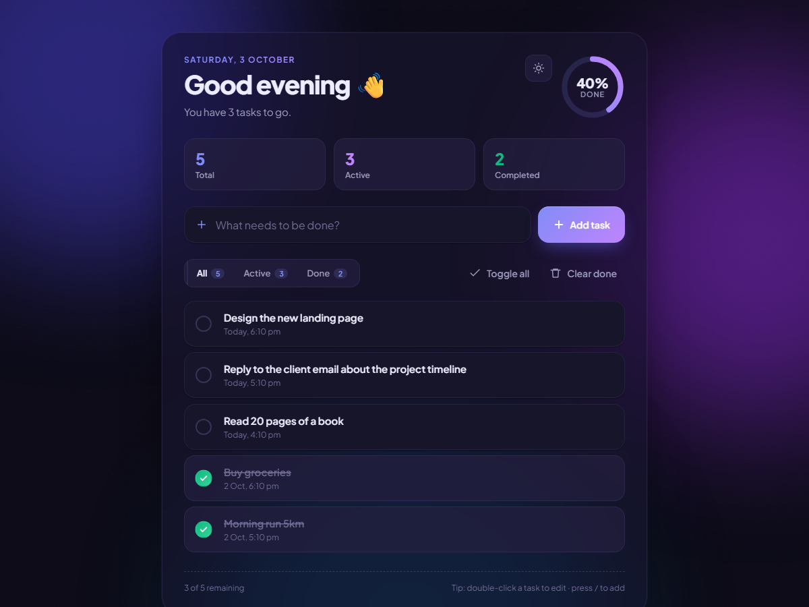
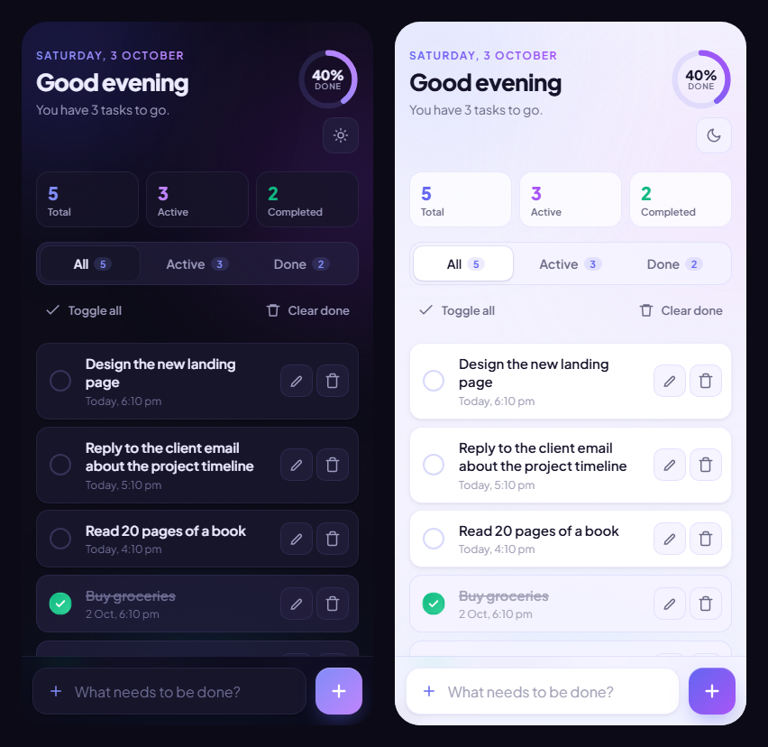

# ✅ ToDoApp

A clean, modern to-do list that runs entirely in the browser, built with **plain HTML, CSS and JavaScript**. It has no frameworks, no dependencies and no build step.

Dark mode is the default, with a one-tap light theme. The layout is designed for phones first, and your tasks are saved in your browser.



<p align="center">
  
</p>

---

## ✨ Features

- **Add, edit, complete and delete tasks.** Double-click a task, or tap ✏️, to edit it inline.
- **Filters:** All / Active / Done, each with a live count.
- **Progress ring and stats** showing how many tasks are total, active and completed.
- **Dark and light themes:** dark by default, and your choice is remembered.
- **Built for phones:**
  - The input bar sits at the bottom of the screen, within thumb reach.
  - Buttons and checkboxes have large tap targets.
  - The layout leaves room for iPhone notches.
- **Saved automatically** to `localStorage`. There's no account or backend.
- **Keyboard shortcuts:**
  - `/` or `n` focuses the input.
  - `Enter` adds a task.
  - `Esc` cancels an edit.
- **Accessible:**
  - Semantic markup and ARIA labels.
  - Visible keyboard focus.
  - Respects `prefers-reduced-motion`.

## 🛠 Tech stack

| Layer   | Tech |
|---------|------|
| Markup  | HTML5 (`<template>` for task items) |
| Styling | CSS3 (custom properties, `backdrop-filter`, grid/flex, media queries) |
| Logic   | Vanilla JavaScript (ES2020) |
| Storage | Browser `localStorage` |
| Font    | [Plus Jakarta Sans](https://fonts.google.com/specimen/Plus+Jakarta+Sans) (Google Fonts) |

## 🚀 Getting started

### Prerequisites
- Any modern browser (Chrome, Edge, Firefox, Safari).
- *Optional:* [Node.js](https://nodejs.org) 18+ or Python 3, to run a local server.

### Clone

```bash
git clone https://github.com/MayureshRepository/ToDoApp.git
cd ToDoApp
```

### Run

There is nothing to install or build. Pick any one of these:

**1. Open the file directly**
```bash
start index.html        # Windows
open index.html         # macOS
xdg-open index.html     # Linux
```

**2. Use a local server (recommended)**
```bash
npx serve .
# or
python -m http.server 5500
```
Then open the URL it prints, for example `http://localhost:3000`.

**3. Use VS Code Live Server.** Install the *Live Server* extension, right-click `index.html`, and choose **Open with Live Server**.

> 📱 **To test on your phone**, run a local server (option 2), then open `http://<your-PC-IP>:<port>` from a phone on the same Wi-Fi. On desktop, you can use DevTools device mode (`Ctrl+Shift+M`).

## 📁 Project structure

```
ToDoApp/
├── index.html      # Markup and the task item <template>
├── todo.css        # Theme tokens (dark default + light), layout, animations, mobile styles
├── todo.js         # State, localStorage persistence, rendering, events, theme toggle
├── screenshots/    # Images used in this README
└── README.md
```

## 🎨 Customizing

| To change…        | Edit |
|-------------------|------|
| Colors / themes   | CSS variables at the top of `todo.css`. `:root` is the **dark** theme and `:root[data-theme="light"]` is the light theme. |
| Phone layout      | The `@media (max-width: 600px)` block near the end of `todo.css` |
| Markup            | `index.html` |
| Behaviour         | `todo.js` |

**Storage keys:**
- `todos-v2` holds your tasks.
- `todo-theme` holds the theme you picked.

To reset the app, run `localStorage.clear()` in the browser console.

## 🌐 Deploy

This is a static site, so any static host works. **No build command is needed.**

| Host | How |
|------|-----|
| **GitHub Pages** | Repo → *Settings → Pages* → *Deploy from a branch* → `main` / `(root)`. The app goes live at `https://mayureshrepository.github.io/ToDoApp/`. |
| **Netlify** | Drag the folder onto <https://app.netlify.com/drop>, or run `npx netlify deploy --prod --dir .` |
| **Vercel** | Run `npx vercel --prod` (framework preset: *Other*). |
| **Cloudflare Pages** | Leave the build command empty and set the output directory to `/`. |

### Optional: minify for production

```bash
mkdir dist
npx html-minifier-terser index.html --collapse-whitespace --remove-comments --minify-css true --minify-js true -o dist/index.html
npx clean-css-cli -o dist/todo.css todo.css
npx terser todo.js -c -m -o dist/todo.js
```

## 🧩 Troubleshooting

- **The font looks different.** Google Fonts is blocked or you're offline. The app falls back to the system font.
- **My tasks disappeared.** `localStorage` is separate for each origin. `file://`, `localhost` and your deployed URL each keep their own list, and private windows clear it when they close.
- **The app opens in light mode.** You picked light earlier. Tap the 🌙 icon to go back to the dark default.

## 📄 License

Released under the [MIT License](https://opensource.org/licenses/MIT). Feel free to use and modify it.
